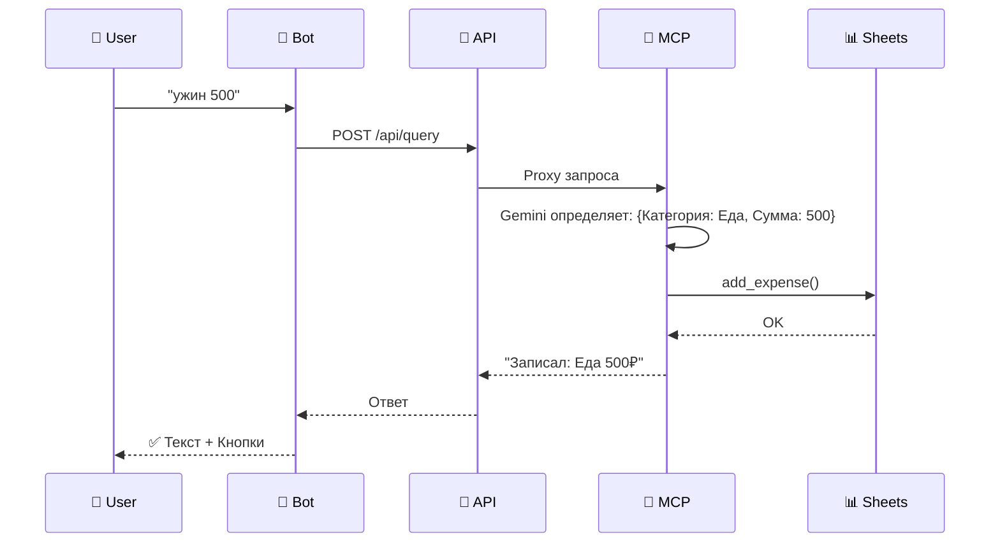

# 🔍 Анализ кодовой базы Budget Assistant v2.0

## ⚡ TL;DR

**Budget Assistant** — это Telegram-бот для учёта личных расходов с AI.
Пользователь пишет "кофе 150р", бот распознаёт категорию и сохраняет запись в Google Sheets.

**Три сервиса:**
Telegram → **Bot** (8080) → **API Gateway** (8081) → **MCP Service** (8082) → Google Sheets

**Запуск локально:**
```bash
# Вариант 1: Docker
docker-compose up --build

# Вариант 2: Вручную (3 терминала)
poetry run python -m src.mcp.app
poetry run python -m src.api.app
poetry run python -m src.bot.run_polling
```

**Где основной код:**
*   **Бот:** `src/bot/handlers/` — интерфейс и команды.
*   **AI:** `src/mcp/agents/` — логика распознавания (Gemini).
*   **Данные:** `src/mcp/storage/sheets.py` — запись в таблицу.

---

## ⚙️ Как это работает (упрощённо)

**Пример:** пользователь пишет боту `ужин 500`.



### 5 шагов обработки (вместо 20)

| Шаг | Где | Что происходит |
| :--- | :--- | :--- |
| **1** | **Bot** | Получает сообщение, отправляет статус "печатает..." |
| **2** | **API** | Проксирует запрос в MCP, проверяет авторизацию и лимиты |
| **3** | **MCP** | AI-агент (Gemini) понимает намерение и извлекает данные (сумма, категория) |
| **4** | **Storage** | Данные записываются новой строкой в Google Sheets |
| **5** | **Bot** | Форматирует ответ AI в красивое сообщение с кнопками управления |

---

## 🚀 Первые шаги разработчика

### 🛠 Хочу запустить локально
1.  **Установить:** `poetry install`
2.  **Настроить:** `cp .env.example .env` (заполнить токен бота и ключи Google).
3.  **Запустить:** см. команды в TL;DR.

### 🤖 Хочу понять код бота
1.  `src/bot/handlers/__init__.py` — главная функция `handle_text()`, входная точка сообщений.
2.  `src/bot/keyboards/` — вся вёрстка кнопок (inline и reply).
3.  `src/bot/formatters/` — функции, создающие текст ответов (HTML разметка).

### 🧠 Хочу понять AI-логику
1.  `src/mcp/agents/adk_agents.py` — инициализация агента и оркестратора.
2.  `prompts/agents/` — Jinja2-шаблоны промптов, объясняющие AI его роль.
3.  `prompts/loader.py` — загрузчик промптов с динамическими переменными.
4.  `src/mcp/agents/tools/` — Python-функции, которые AI может вызывать (Tools).

### ✨ Хочу добавить новую фичу
1.  **Команда бота:** Создать хендлер в `src/bot/handlers/commands.py`.
2.  **Инструмент AI:** Добавить функцию в `src/mcp/agents/tools/` и зарегистрировать в агенте.
3.  **API метод:** Добавить роут в `src/api/routes/__init__.py`.

### 🐛 Хочу пофиксить баг
*   **Где логи:** В консоли терминала (stdout). Уровень логов меняется в `.env` (`LOG_LEVEL=DEBUG`).
*   **Типичные ошибки:**
    *   `QuotaExceededError` — кончились лимиты Gemini (жди минуту).
    *   `ServiceUnavailableError` — упал MCP или API сервис.
    *   `gspread.exceptions.APIError` — проблемы с правами Google Service Account.

### 📝 Хочу добавить категорию расходов
*   Править файл: `src/core/categories.py`.
*   Добавить в словарь `CATEGORY_EMOJI`.
*   AI подхватит изменение автоматически (словарь загружается в промпт через Jinja2).

### ✏️ Хочу изменить промпт агента и протестировать

**Где находятся промпты:**
*   `prompts/agents/orchestrator.j2` — промпт главного оркестратора
*   `prompts/agents/registrar.j2` — промпт агента добавления/удаления расходов
*   `prompts/agents/analyst.j2` — промпт агента статистики и аналитики

**Как редактировать:**
1.  Открыть нужный `.j2` файл в редакторе
2.  Промпты используют Jinja2-шаблоны с переменными:
    *   `{{ categories }}` — список категорий (registrar.j2)
    *   `{{ categories_with_emoji }}` — категории с эмодзи (analyst.j2)
    *   `{{ current_date }}` — текущая дата в формате DD.MM.YYYY (analyst.j2)
3.  Сохранить изменения

**Примеры изменений:**
```jinja
{# Было: #}
Ты - агент-регистратор для семейного бюджета.

{# Стало (более строгий тон): #}
Ты - агент-регистратор для семейного бюджета.
Твоя задача — ТОЧНО извлечь сумму и категорию из сообщения пользователя.
```

**Как протестировать:**

*   **Вариант 1: Локально (polling)**
    ```bash
    # Перезапустить MCP сервис (он загружает промпты при старте)
    # Ctrl+C в терминале MCP, затем:
    poetry run python -m src.mcp.app

    # Или через docker-compose:
    docker-compose restart mcp

    # Протестировать через бот
    poetry run python -m src.bot.run_polling
    # Написать боту тестовое сообщение
    ```

*   **Вариант 2: Cloud Run (production)**
    ```bash
    # Redeploy MCP сервиса с новыми промптами
    ./scripts/deploy_mcp.sh

    # Проверить логи
    gcloud run services logs read budget-mcp --limit=20
    ```

*   **Вариант 3: Прямое тестирование через MCP Server**
    ```bash
    # Запустить MCP в stdio режиме
    poetry run python -m src.mcp.server.run_stdio

    # Или использовать MCP Inspector
    ./scripts/test_mcp_inspector.sh
    # Открыть http://localhost:8083 в браузере
    ```

**Полезные ресурсы:**
*   `prompts/agents/README.md` — документация по prompt engineering техникам
*   `prompts/loader.py` — код загрузчика промптов (если нужно добавить переменные)

### 🧪 Хочу написать тест
*   **Структура:** `tests/test_bot/`, `tests/test_api/`, `tests/test_mcp/`.
*   **Запуск:** `poetry run pytest` (все) или `poetry run pytest tests/path/to/test.py`.
*   **Правило:** Тесты асинхронные, используйте `@pytest.mark.asyncio`.

### ☁️ Хочу задеплоить
*   **Скрипт:** `./scripts/deploy_all.sh` (деплоит всё в Google Cloud Run).
*   **Требования:** Установленный `gcloud` CLI, авторизация, наличие `docker`.

---

## 🗺 Карта кодовой базы

### Слой 1: Telegram Bot (`src/bot`)
| Файл | Описание |
| :--- | :--- |
| `run_polling.py` | Запуск локально (Polling). |
| `handlers/commands.py` | Обработка команд (`/start`, `/stats`, `/help`). |
| `middlewares/` | Трейсинг запросов (`RequestIdMiddleware`) и инжекция HTTP-клиента. |

### Слой 2: API Gateway (`src/api`)
| Файл | Описание |
| :--- | :--- |
| `app.py` | Настройка FastAPI сервера (порт 8081). |
| `routes/__init__.py` | Маршрутизация запросов (Proxy → MCP). |

### Слой 3: MCP & AI (`src/mcp`)
| Файл | Описание |
| :--- | :--- |
| `agents/adk_agents.py` | Мозг системы (Gemini + google-adk). |
| `storage/sheets.py` | Драйвер Google Sheets (чтение/запись). |
| `server/run_stdio.py` | Альтернативный запуск через STDIO (для Claude Desktop). |

### Слой 4: Core (`src/core`)
| Файл | Описание |
| :--- | :--- |
| `config.py` | Глобальные настройки (Pydantic). |
| `schemas.py` | Модели данных для обмена между сервисами. |
| `categories.py` | Список категорий и эмодзи. |

---

## 🔬 Углублённо (для продвинутых)

### Полный алгоритм обработки запроса (20 шагов)

<details>
<summary>Нажмите, чтобы раскрыть детали прохождения запроса "ужин 500"</summary>

1.  **Начало:** Сервис бота (`src/bot/run_polling.py`) получает `Update` от Telegram API.
2.  **Middleware:** Запрос проходит через `RequestIdMiddleware` (генерация ID для трейсинга) и `APIClientMiddleware` (подготовка HTTP-клиента).
3.  **Хендлер:** В `src/bot/handlers/__init__.py` срабатывает функция `handle_text`.
4.  **Визуализация:** Вызывается `message.bot.send_chat_action(..., "typing")` (статус «печать»).
5.  **Классификация:** Бот проверяет, является ли запрос просьбой показать статистику (нет).
6.  **Вызов API Gateway:** Бот делает POST-запрос к API-шлюзу через `ServiceClient.post("/api/query", ...)` (`src/core/http_client.py`).
7.  **Прием в Gateway:** Сервис `api` (`src/api/app.py`) принимает запрос на порт 8081.
8.  **Маршрутизация Gateway:** В `src/api/routes/__init__.py` срабатывает роут `process_query`, проксирующий запрос в MCP.
9.  **Прием в MCP:** Сервис `mcp` (`src/mcp/app.py`) принимает запрос на порт 8082.
10. **Обработка в MCP:** В `src/mcp/routes/__init__.py` вызывается `process_mcp_query`, обращающийся к `ADKBudgetAgent`.
11. **Инициализация Агента:** В `src/mcp/agents/adk_agents.py` создается экземпляр агента (`google-adk`).
12. **LLM (Gemini):** Текст «ужин 500» отправляется в модель. Модель определяет intent и параметры: `amount=500`, `category=Еда`, `description=ужин`.
13. **Tool Call:** LLM выбирает инструмент (tool) для записи расхода.
14. **Вызов хранилища:** Вызывается метод `add_expense` из `src/mcp/storage/sheets.py`.
15. **Внешний сервис (Google Sheets):** Используется библиотека `gspread` для отправки данных.
16. **Результат записи:** Данные успешно добавлены, `Storage` возвращает статус успеха.
17. **Формирование ответа:** Агент генерирует текстовое подтверждение на русском языке.
18. **Возврат по цепочке:** Ответ возвращается MCP → API Gateway → Bot.
19. **Пост-обработка в боте:** В `handle_text` анализируется ответ. Бот решает показать клавиатуру `get_after_add_keyboard()`.
20. **Завершение:** Бот отправляет финальное сообщение пользователю через `send_chunked_message` (`src/bot/utils.py`).

</details>

### Архитектурные паттерны
*   **Model Context Protocol (MCP):** Стандарт взаимодействия с AI-агентами. Позволяет подключать бюджетного агента к Claude Desktop или другим MCP-клиентам.
*   **Dependency Injection:** Используется в FastAPI (`Depends`) для подмены клиентов и хранилищ (удобно для тестов).
*   **Stateless:** Сервисы не хранят состояние пользователей в памяти (всё в Google Sheets или Redis/DB в будущем).

### Известные проблемы и TODO
1.  ~~**Race Condition:** При одновременной записи в таблицу возможна потеря данных.~~ ✅ **Исправлено в Iteration 13:** используется атомарный `append_row()` и `asyncio.Lock()` для `_connect()`.
2.  **Dead Code:** `RateLimitMiddleware` и `AccessControlMiddleware` определены, но не зарегистрированы — либо удалить, либо подключить.
3.  ~~**Синхронность:** `gspread` работает синхронно, блокируя поток.~~ ✅ **Решено:** используется `run_in_executor()` для асинхронного выполнения.
